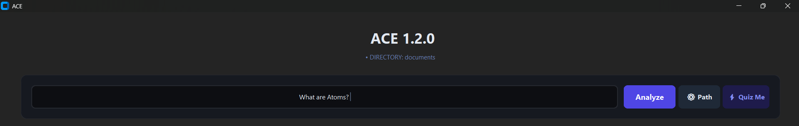
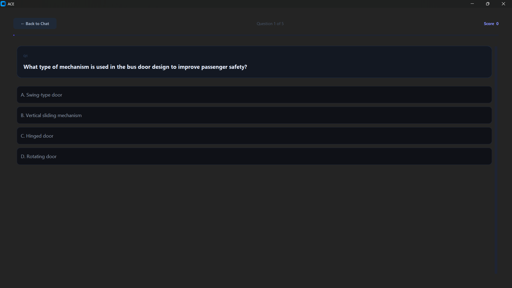
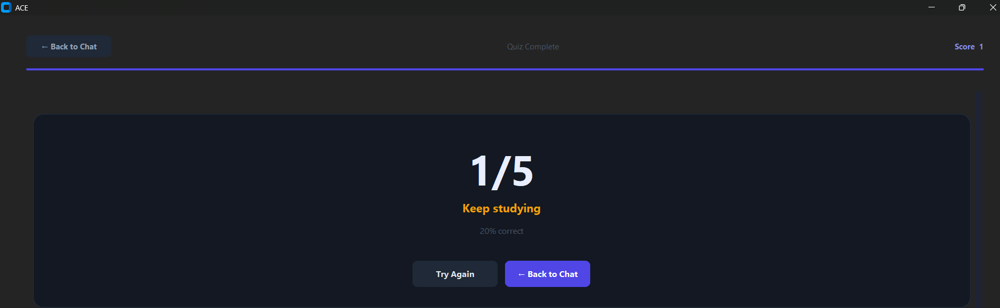

# Study Assistant

Ask questions directly from your own notes — online or offline.

Study Assistant is a native desktop application that searches your local note collection using semantic search and AI-powered retrieval, then generates grounded answers based on your material instead of the general internet.

Built for students, self-learners, researchers, and anyone who maintains large collections of study notes.

---

## Preview

### Main Interface

---
### Question

----
### ANSWER

---
### QUIZ

---
### RESULTS


---

## Features

- Semantic note search using Sentence Transformers
- Multi-file context retrieval
- AI-generated explanations grounded in your notes
- Supports beginner, detailed, comparison, and ELI5 explanations
- Automatic source file tracking
- Local-first note workflow
- Conversation history — ask follow-up questions naturally
- Embedding cache — fast startup after first launch
- Supports PDF, DOCX, PPTX, TXT, and MD formats
- Chunk-level relevance filtering for large documents
- Fast desktop interface built with CustomTkinter
- Multiple AI provider fallback system
  - Google Gemini
  - Groq
  - OpenRouter
- Offline mode via Ollama — works without internet
- Now has an exe file support for users who dont want the setup hassle.
- The Quiz mode is now available. You can test yourself on your notes. 
---

## Online vs Offline

Study Assistant works in both modes automatically.

Study Assistant tries providers in this order, falling back automatically if one is unavailable:

1. Ollama (local) — tried first if running, fastest and fully offline
2. Google Gemini
3. Groq
4. OpenRouter

This means if Ollama is running locally, it's used immediately with no network call at all. If it's not running, the app falls through to whichever cloud providers have API keys configured.

If no internet is detected and Ollama is not running, the app will guide you with clear instructions on what to do.

---

## How It Works

1. Load your notes folder.
2. Ask a question.
3. Study Assistant searches your notes using:
   - Keyword matching
   - Semantic embeddings
4. The most relevant notes are retrieved.
5. Relevant chunks are filtered and sent to the selected LLM.
6. The answer is generated using your notes.
7. Source files used for the answer are displayed.

---

## Example

### Question

```text
What is the difference between CNN and RNN?
```

### Output

```text
CNNs are primarily designed to process spatial information such as images.

RNNs are designed to process sequential information where previous inputs influence future outputs.

Key Difference:
- CNNs focus on spatial relationships.
- RNNs focus on temporal relationships.
```

### Sources Used

```text
Deep Learning Notes.txt
Neural Networks.txt
CNN vs RNN.txt
```

---

## Installation

### 1. Clone the Repository

```bash
git clone https://github.com/YOUR_USERNAME/Ace.git
cd Ace
```

### 2. Create a Virtual Environment

```bash
python -m venv venv
```

Windows:

```bash
venv\Scripts\activate
```

Linux / macOS:

```bash
source venv/bin/activate
```

### 3. Install Dependencies

```bash
pip install -r requirements.txt
```

## Quick Start — Two Ways to Run This

**Option A — No account needed (Ollama, fully offline)**
Skip API keys entirely. Install Ollama, pull a model, and you're done — see the Ollama Setup section below. No signup, no internet required after setup.

**Option B — Cloud providers (faster, optional)**
If you'd rather use a cloud AI provider, get a free API key from one of:
- [Google AI Studio](https://aistudio.google.com/apikey) — free Gemini key
- [Groq](https://console.groq.com/keys) — free, generous rate limits
- [OpenRouter](https://openrouter.ai/keys) — free tier models available

Takes about 2 minutes. Paste it into your `.env` file and you're set.

You only need ONE of the two options above — not both.


### 4. Configure Environment Variables
> Skip this step entirely if you're using Ollama (Option A above).
Create a `.env` file using `.env.example`.

Example:

```env
GEMINI_API_KEY=your_key_here
GROQ_API_KEY=your_key_here
OPENROUTER_API_KEY=your_key_here
```

You only need one provider configured, but multiple providers enable automatic fallback.

At least one cloud provider key is recommended. If you only want offline mode, see Ollama Setup below and you can leave all keys empty.

### 5. Run the Application

```bash
python main.py
```

---

## Ollama Setup (Offline Mode)

Ollama lets Study Assistant run fully offline using a local AI model on your machine.

### 1. Install Ollama

Download and install from:

```
https://ollama.com/download
```

### 2. Pull the Model

```bash
ollama pull llama3.2
```

This downloads the model once (~2 GB). No re-download on subsequent launches.

### 3. Start Ollama

Ollama usually starts automatically on boot. If it is not running, start it manually:

```bash
ollama serve
```

Study Assistant will detect Ollama automatically on the next launch and switch to offline mode.

---

## Supported File Formats

Study Assistant works with the following file formats out of the box:

- `.txt` — plain text notes
- `.md` — Markdown notes
- `.pdf` — PDF documents and textbooks
- `.docx` — Microsoft Word documents
- `.pptx` — PowerPoint lecture slides

No special formatting is required.

---

## Technology Stack

### Frontend

- Python
- CustomTkinter

### Retrieval System

- Sentence Transformers
- all-MiniLM-L6-v2

### AI Providers

- Google Gemini
- Groq
- OpenRouter
- Ollama (local)

### Core Concepts

- Semantic Search
- Retrieval-Augmented Generation (RAG)
- Embedding Similarity Search
- Chunk-Level Context Filtering
- Context-Based Answer Generation

---

## Project Goals

The goal of Study Assistant is to make personal notes searchable through natural language.

Instead of manually opening dozens of files, users can ask questions and receive answers generated directly from their own knowledge base — with no dependency on the internet if preferred.

---

## Roadmap

### Completed in v1.0
- PDF, DOCX, PPTX support
- Conversation history
- Embedding cache for fast subsequent launches
- Chunk-level relevance filtering for large documents
- Multi-provider cloud AI fallback
- Offline mode via Ollama


### Future
- Cross-platform packaging
- Mobile companion app

---

## Contributing

Contributions, suggestions, bug reports, and feature requests are welcome.
If you find a bug or have an idea for improvement, open an issue.

---

## License

MIT License

Feel free to use, modify, and distribute this project.

---

## Author

Built by a student developer who wanted a better way to study from personal notes using AI.