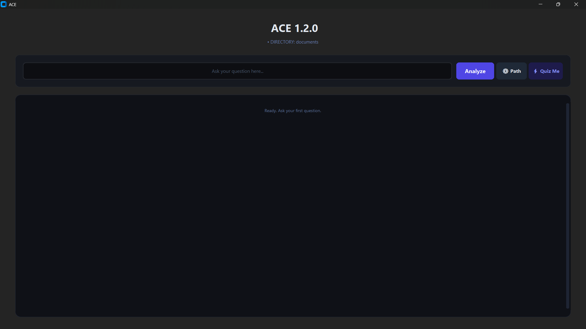
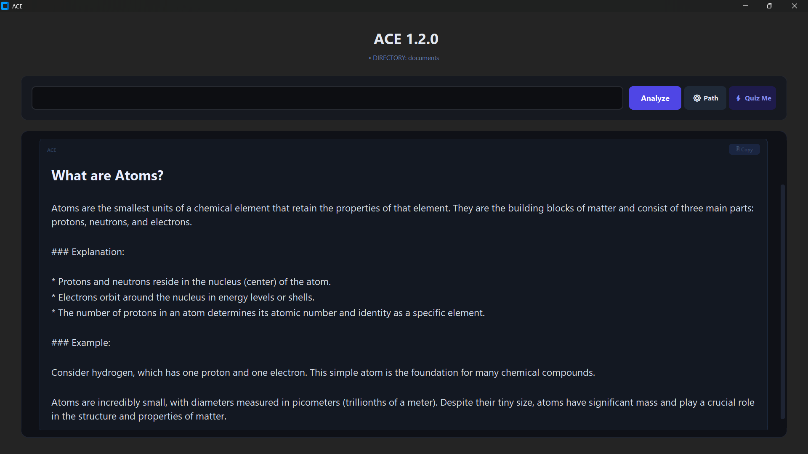
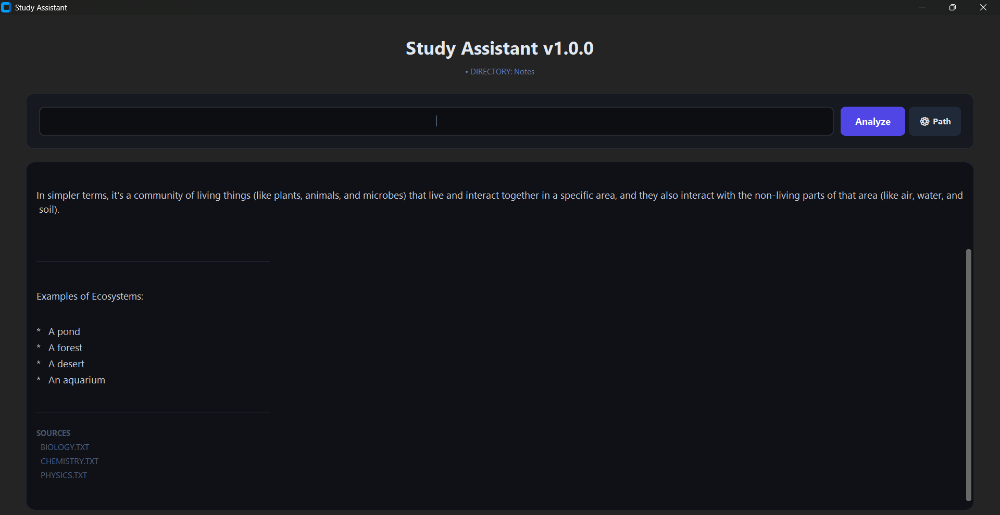

# Study Assistant

Ask questions directly from your own notes.

Study Assistant is a native desktop application that searches your local note collection using semantic search and AI-powered retrieval, then generates grounded answers based on your material instead of the general internet.

Built for students, self-learners, researchers, and anyone who maintains large collections of study notes.

---

## Preview

### Loading Screen


# --------------------------------------------------------------------------------------------------
### Main Interface

# --------------------------------------------------------------------------------------------------

### Actual Notes

# --------------------------------------------------------------------------------------------------

### Asking a Question

# --------------------------------------------------------------------------------------------------

### Generated Answer

# --------------------------------------------------------------------------------------------------

### Generated Answer 2

# --------------------------------------------------------------------------------------------------


---

---

## Features

- Semantic note search using Sentence Transformers
- Multi-file context retrieval
- AI-generated explanations grounded in your notes
- Supports beginner, detailed, comparison, and ELI5 explanations
- Automatic source file tracking
- Local-first note workflow
- Fast desktop interface built with CustomTkinter
- Multiple AI provider fallback system
  - Google Gemini
  - Groq
  - OpenRouter

---

## How It Works

1. Load your notes folder.
2. Ask a question.
3. Study Assistant searches your notes using:
   - Keyword matching
   - Semantic embeddings
4. The most relevant notes are retrieved.
5. Relevant context is sent to the selected LLM.
6. The answer is generated using your notes.
7. Source files used for the answer are displayed.

---

## Example

### Question

```text
What is the difference between CNN and RNN?
```

### Output

```text
CNNs are primarily designed to process spatial information such as images.

RNNs are designed to process sequential information where previous inputs influence future outputs.

Key Difference:
- CNNs focus on spatial relationships.
- RNNs focus on temporal relationships.
```

### Sources Used

```text
Deep Learning Notes.txt
Neural Networks.txt
CNN vs RNN.txt
```

---

## Installation

### 1. Clone the Repository

```bash
git clone https://github.com/YOUR_USERNAME/Study-Assistant.git
cd Study-Assistant
```

### 2. Create a Virtual Environment

```bash
python -m venv venv
```

Windows:

```bash
venv/Scripts/activate
```

Linux / macOS:

```bash
source venv/bin/activate
```

### 3. Install Dependencies

```bash
pip install -r requirements.txt
```

### 4. Configure Environment Variables

Create a `.env` file using `.env.example`.

Example:

```env
GEMINI_API_KEY=your_key_here
GROQ_API_KEY=your_key_here
OPENROUTER_API_KEY=your_key_here
```

You only need one provider configured, but multiple providers enable automatic fallback.

### 5. Run the Application

```bash
python main.py
```

---

## Notes Format

Study Assistant works with ordinary `.txt` files.

Example:

```text
Neural networks are machine learning models inspired by the human brain.

Convolutional Neural Networks (CNNs) are commonly used for image processing.

Recurrent Neural Networks (RNNs) are designed for sequential data.
```

No special formatting is required.

---

## Technology Stack

### Frontend

- Python
- CustomTkinter

### Retrieval System

- Sentence Transformers
- all-MiniLM-L6-v2

### AI Providers

- Google Gemini
- Groq
- OpenRouter

### Core Concepts

- Semantic Search
- Retrieval-Augmented Generation (RAG)
- Embedding Similarity Search
- Context-Based Answer Generation

---

## Project Goals

The goal of Study Assistant is to make personal notes searchable through natural language.

Instead of manually opening dozens of files, users can ask questions and receive answers generated directly from their own knowledge base.

---

## Roadmap

### Version 1.1

- PDF support
- Better note indexing
- Improved retrieval scoring
- Rich source citations

### Version 1.2

- Conversation memory
- Export answers
- Note statistics and analytics

### Future

- Local LLM support
- Cross-platform packaging
- Mobile companion app

---

## Contributing

Contributions, suggestions, bug reports, and feature requests are welcome.

If you find a bug or have an idea for improvement, open an issue.

---

## License

MIT License

Feel free to use, modify, and distribute this project.

---

## Author

Built by a student developer who wanted a better way to study from personal notes using AI.